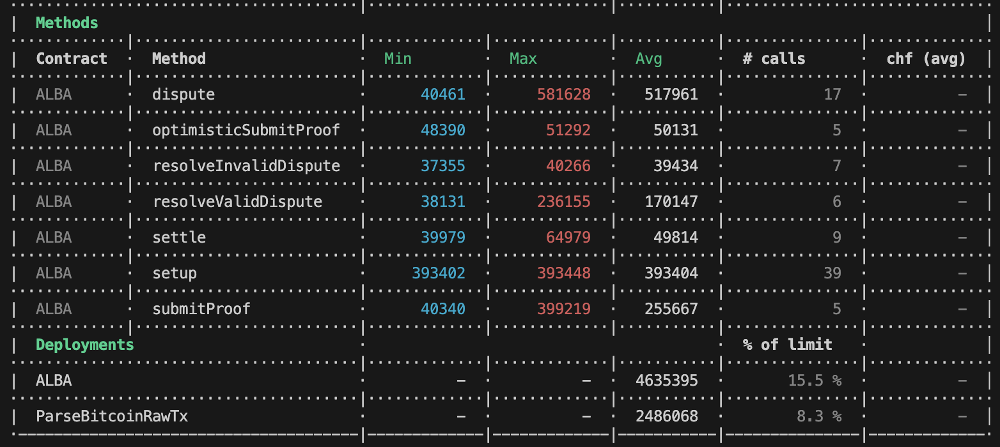
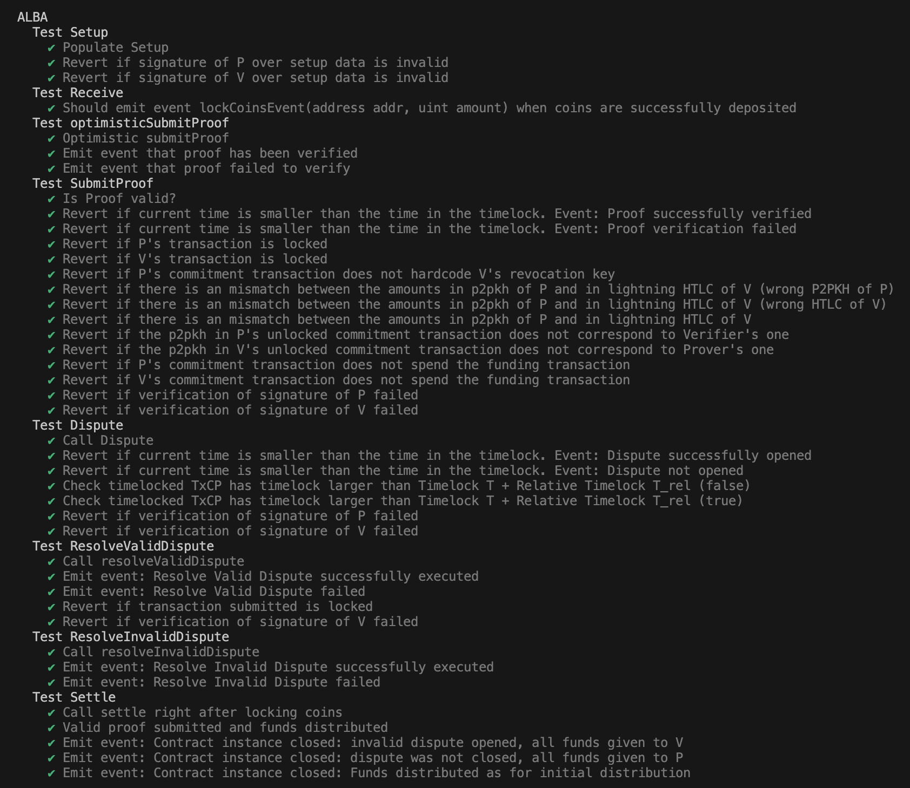
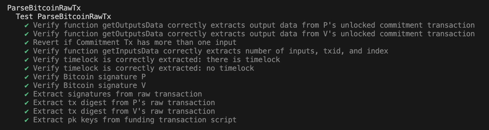

# Proof-of-Concept of the ALBA Smart Contract

## The ALBA Protocol
A Proof-of-Concept implementation of the ALBA protocol, connecting the Lightning Network (LN, a layer-2 on top of Bitcoin) to Ethereum. It allows to verify on Ethereum (or on any other EVM-based chain) the state of a LN channel, either the current state of the channel or an upcoming update thereof.

Costs are evaluated both in the optimistic (both parties are honest and cooperate) and in the pessimistic (one of the parties is adversarial) setting.  

## Prerequisites

Please make sure that Docker is installed in your commodity laptop. You can download Docker [here](https://docs.docker.com/engine/install/).

## Build and Run

Once Docker is installed, clone this repository. Open a terminal and navigate to the project folder by running 

``` cd /path/to/the/cloned/repository ```

Build the Docker image by typing the following command within the Alba-Bridge folder:

``` docker build --no-cache -t alba . ```

Run the gas cost evaluation of Alba within Docker by executing the following command in your terminal:

``` docker run alba ```

## Notes
This project uses [Hardhat](https://hardhat.org/hardhat-runner/docs/getting-started) to compile, run, and test the smart contracts on a local development network. 

This project includes ParseBTCLib.sol a Solidity library for parsing Bitcoin transactions, including signature verification.

It also contains a python folder taken from [python-bitcoin-utils](https://github.com/karask/python-bitcoin-utils) and modified to generate protocol-specific LN transactions.

## Contributing
This is a research prototype. We welcome anyone to contribute. File a bug report or submit feature requests through the issue tracker. If you want to contribute feel free to submit a pull request.

## Gas Cost Evaluation 


## Tests 
Tests for the contract

Tests for the library


